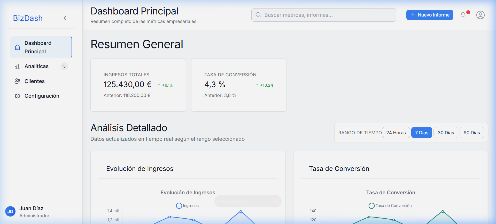
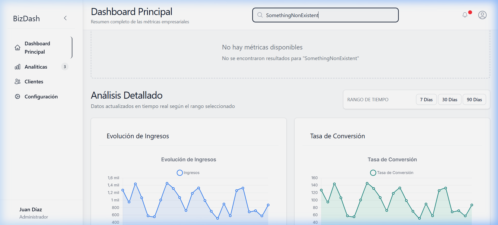
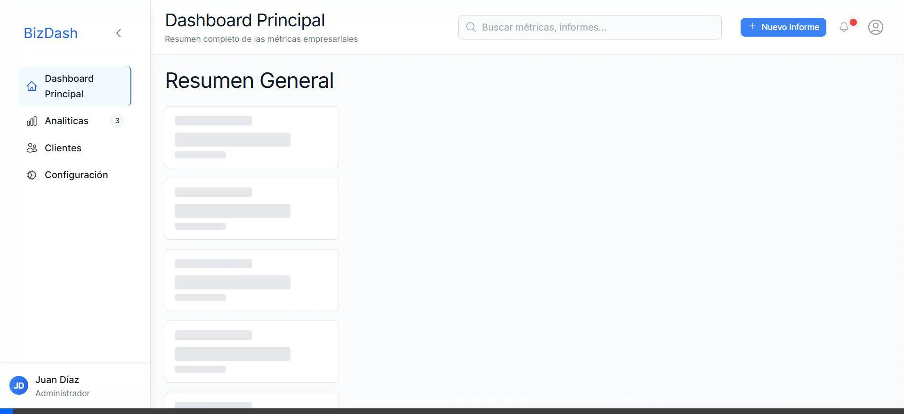

# BizDash - Dashboard Empresarial Avanzado



**BizDash** es un panel de control empresarial moderno y de alto rendimiento construido con **Next.js 15**. Ofrece una experiencia visual premium con métricas en tiempo real, análisis detallados y una arquitectura escalable basada en **Atomic Design**.

## ✨ Características Principales

- 📊 **Visualización de Datos**: Gráficos interactivos de ingresos, conversión y usuarios mediante `Chart.js`.
- 🔍 **Búsqueda en Tiempo Real**: Filtrado dinámico de métricas y dashboards.
- ⏱️ **Filtros Temporales**: Selección de rangos de tiempo (24h, 7d, 30d, 90d) con hidratación inmediata.
- 📱 **Diseño Responsive Pro**: Sidebar colapsable y layouts adaptativos para móviles y tablets.
- 🎨 **Estética Premium**: Interfaz moderna con animaciones fluidas y sistema de diseño profesional.
- 🚀 **Despliegue Docker**: Configuración completa para producción en contenedores.

## 🛠️ Stack Tecnológico

- **Framework**: [Next.js 15 (App Router)](https://nextjs.org/)
- **Estilos**: [Tailwind CSS 3](https://tailwindcss.com/)
- **Gestión de Estado**: [Zustand](https://zustand-demo.pmnd.rs/)
- **Gráficos**: [Chart.js](https://www.chartjs.org/) & [react-chartjs-2](https://react-chartjs-2.js.org/)
- **Iconos**: [Heroicons](https://heroicons.com/)
- **Infraestructura**: Docker & Docker Compose
- **Testing**: Jest & Cypress

## 📁 Estructura del Proyecto

El proyecto sigue los principios de **Atomic Design** para asegurar la mantenibilidad y escalabilidad de los componentes UI:

```bash
src/
├── components/
│   ├── atoms/         # Componentes base (Botones, Typography, Badges)
│   ├── molecules/     # Combinaciones simples (MetricCard, SearchBar)
│   ├── organisms/     # Secciones complejas (MetricsGrid, ChartsSection)
│   ├── templates/     # Layouts de página y estructuras globales
│   └── optimization/  # Componentes de carga diferida y monitoreo
├── hooks/             # Lógica de negocio y hooks personalizados
├── lib/               # Utilidades y configuración de librerías
├── services/          # Llamadas a API y servicios de datos
└── types/             # Definiciones de TypeScript
```

## 🚀 Instalación y Uso

### Requisitos Previos
- Node.js 18+ 
- npm o yarn

### Desarrollo Local

1. Instalar dependencias:
   ```bash
   npm install
   ```

2. Iniciar el servidor de desarrollo:
   ```bash
   npm run dev
   ```
   Accede a `http://localhost:3001`

3. Ejecutar pruebas:
   ```bash
   npm test          # Pruebas unitarias (Jest)
   npm run cypress   # Pruebas E2E (Cypress)
   ```

### 🐳 Despliegue con Docker

Para correr la aplicación en un entorno de producción optimizado:

```bash
docker-compose up --build -d
```
Accede a la versión de producción en `http://localhost:3000`

## 📸 Showcase Visual

### Dashboard Principal


### Búsqueda e Interactividad


### Verificación Docker


---

Desarrollado con ❤️ para la gestión empresarial moderna.
